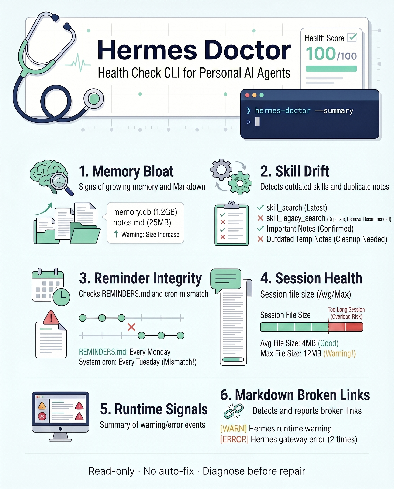

# Hermes Doctor

<p align="center">
  
</p>

<p align="center">
  <a href="https://pypi.org/project/hermes-doctor/"></a>
  <a href="https://pypi.org/project/hermes-doctor/"></a>
  <a href="https://github.com/samahn0601/hermes-doctor/blob/main/LICENSE"></a>
  <a href="https://github.com/samahn0601/hermes-doctor/actions/workflows/ci.yml"></a>
</p>

> **Linters check your code. Hermes Doctor checks your agent's mind.**

A local, read-only annual physical for a long-lived personal [Hermes Agent](https://hermes-agent.nousresearch.com/) installation.

Hermes Doctor scans bloated memories, stale skills, reminder/cron drift, oversized sessions, broken local Markdown links, and runtime warnings — **without modifying anything**.

Hermes gets better as it remembers. But long-lived personal agents also accumulate entropy.

It started as a family physician's tool for treating a different kind of patient: my personal AI agent. Designed by someone who thinks in preventive checkups, not emergency surgery.

> Early public preview. Useful, small, and intentionally conservative.

## Non-goals

Hermes Doctor is deliberately small. The following are **not** going to happen:

- ❌ No `--fix` mode, ever. The doctor writes the prescription; you go to the pharmacy.
- ❌ No cloud service, dashboard, or telemetry. Reports are local-only.
- ❌ No automatic memory deduplication, skill rewriting, or cron reconciliation.
- ❌ No support for other agent frameworks (AutoGPT, LangChain, etc.) until Hermes itself is stable.
- ❌ No generic Markdown linting — there are better tools for that.
- ❌ No runtime dependencies in the core scanner. Stdlib only.

## Who is this for?

Hermes Doctor is for people who run Hermes Agent as a long-lived personal agent and want to know when local state is getting messy:

- people using Hermes memories and skills heavily
- people relying on reminder / cron automation
- people keeping Markdown-based personal state around an agent
- people who want safe diagnosis before cleanup
- people interested in personal agent observability and hygiene

## What it checks

- Markdown bloat and broken local links
- Memory / skill size, duplication, and mutable project-fact candidates
- `REMINDERS.md` vs `hermes cron list` consistency
- Session file size
- Recent runtime / gateway warning and error event counts
- Domain scores and overall health score

## Safety model

Hermes Doctor v1 is observational and read-only.

It does **not**:

- edit files
- delete files
- deduplicate memories or skills
- reconcile reminders
- modify cron jobs
- scan external project folders unless explicitly requested
- send your local data anywhere

Reports redact paths, secret-like strings, and identifier-like strings on a best-effort basis. Do not publish reports from real personal deployments without reviewing them first.

## Privacy

- No telemetry.
- No network calls, except local execution of installed `hermes` CLI commands.
- Reports are generated locally.
- Raw Hermes command output is excluded by default.
- `--debug-raw` is for local debugging only and should not be used for public reports.
- Redaction is best-effort, not a formal secret-scanning guarantee.

## Install

Recommended (zero-install, ephemeral):

```bash
pipx run hermes-doctor --summary
```

Persistent install:

```bash
pipx install hermes-doctor
```

Or from source:

```bash
git clone https://github.com/samahn0601/hermes-doctor.git
cd hermes-doctor
python -m pip install -e .
```


## Usage

```bash
# Full Markdown report
hermes-doctor

# Compact output for cron/watchdogs
hermes-doctor --summary

# Safe JSON output
hermes-doctor --json

# Write timestamped report and refresh <HERMES_HOME>/reports/health/latest.md
hermes-doctor --write-report

# Automation gate: exit 2 on critical findings
hermes-doctor --summary --fail-on critical
```

By default, Hermes Doctor scans only the Hermes home directory:

```bash
hermes-doctor --hermes-home ~/.hermes
```

External Markdown paths are opt-in:

```bash
hermes-doctor --include ./my-notes
hermes-doctor --include-project-hub
```

Raw Hermes command output is excluded by default. For local debugging only:

```bash
hermes-doctor --json --debug-raw
```

## Example summary

```text
Hermes Health: 100/100 (healthy)
Findings: critical=0 warning=0 info=3
Domains: markdown=100, memory_skills=100, reminder_cron=100, session_context=100, runtime_gateway=100
Reminder/Cron: ids=['r_0001']
Runtime: errors=0 warnings=0
Actionable: none
```

## Example finding

```text
Actionable:
- [warning] Memory/skill size warning (memory.size): <HERMES_HOME>/memories/notes.md size=84KB
- [critical] Active reminder missing cron job (reminder.cron_missing): r_0007
```

Hermes Doctor does not fix these automatically. It tells you what to inspect before you change state.

## Scoring model

Hermes Doctor uses heuristic domain scores, not a formal proof of system health.

- warning findings apply a small penalty
- critical findings apply a larger penalty
- the weakest domain is weighted heavily so one bad subsystem is not hidden by a good average
- info findings do not reduce the score

Treat the score as a screening result, not a diagnosis carved in stone.

## Limitations

- Hermes Doctor is heuristic and may produce false positives or false negatives.
- Hermes CLI output formats may change over time.
- Redaction is best-effort; review real reports manually before sharing.
- v1 is intentionally conservative and does not repair state.
- This is not an official Hermes Agent project.

## Development

```bash
python -m pip install -e .[dev]
python -m pytest
python -m ruff check .
```

## Roadmap

- **v0.1** — read-only scanner *(current)*
- **v0.2** — golden fixture corpus + adversarial redaction tests + stable finding IDs (`HD-MEM-001`, `HD-CRON-002`) + analyzer status reporting + PyPI publication
- **v0.3** — dry-run "review candidates" suggestions, conditional on v0.2 trust. Never executable scripts. Still no silent mutation.
- **v1.0+** — boring, trusted, intentionally feature-frozen. Wins by credibility and restraint, not feature volume.

## License

MIT
